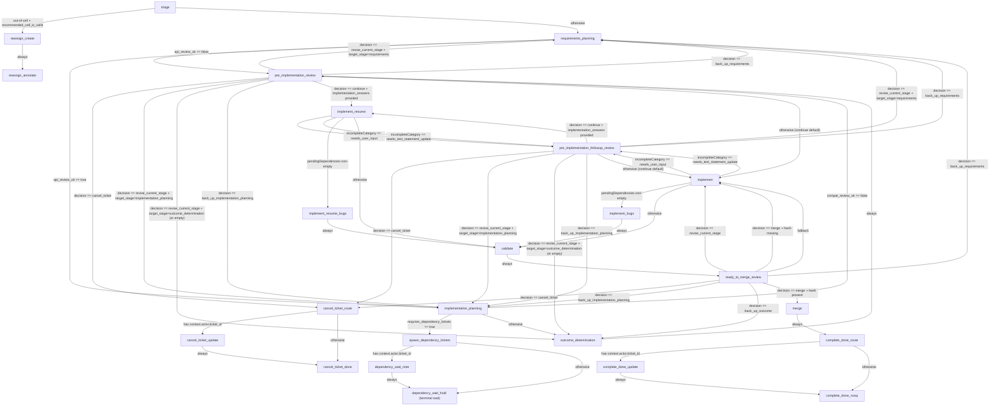

# New Ticket Flowchart (`new-ticket` v0.7.0)

```mermaid
flowchart TD
  TRIAGE["triage"]
  REASSIGN_CREATE["reassign_create"]
  REASSIGN_ANNOTATE["reassign_annotate"]
  REQUIREMENTS["requirements_planning"]
  IMPLEMENTATION_PLAN["implementation_planning"]
  OUTCOME["outcome_determination"]
  SPAWN_DEPS["spawn_dependency_tickets"]
  DEP_WAIT_NOTE["dependency_wait_note"]
  DEP_WAIT_HOLD["dependency_wait_hold (terminal wait)"]

  PRE_REVIEW["pre_implementation_review"]
  PRE_FOLLOWUP["pre_implementation_followup_review"]

  IMPLEMENT["implement"]
  IMPLEMENT_BUGS["implement_bugs"]
  IMPLEMENT_RESUME["implement_resume"]
  IMPLEMENT_RESUME_BUGS["implement_resume_bugs"]

  VALIDATE["validate"]
  MERGE_REVIEW["ready_to_merge_review"]
  MERGE["merge"]

  CANCEL_ROUTE["cancel_ticket_route"]
  CANCEL_UPDATE["cancel_ticket_update"]
  CANCEL_DONE["cancel_ticket_done"]

  COMPLETE_ROUTE["complete_done_route"]
  COMPLETE_UPDATE["complete_done_update"]
  COMPLETE_NOOP["complete_done_noop"]

  TRIAGE -->|"out-of-cell + recommended_cell_is_valid"| REASSIGN_CREATE
  TRIAGE -->|"otherwise"| REQUIREMENTS

  REASSIGN_CREATE -->|"always"| REASSIGN_ANNOTATE

  REQUIREMENTS -->|"api_review_ok == false"| PRE_REVIEW
  REQUIREMENTS -->|"api_review_ok == true"| IMPLEMENTATION_PLAN

  IMPLEMENTATION_PLAN -->|"compat_review_ok == false"| PRE_REVIEW
  IMPLEMENTATION_PLAN -->|"requires_dependency_tickets == true"| SPAWN_DEPS
  IMPLEMENTATION_PLAN -->|"otherwise"| OUTCOME

  SPAWN_DEPS -->|"has context.actor.ticket_id"| DEP_WAIT_NOTE
  SPAWN_DEPS -->|"otherwise"| DEP_WAIT_HOLD
  DEP_WAIT_NOTE -->|"always"| DEP_WAIT_HOLD

  OUTCOME -->|"always"| PRE_REVIEW

  PRE_REVIEW -->|"decision == cancel_ticket"| CANCEL_ROUTE
  PRE_REVIEW -->|"decision == revise_current_stage + target_stage=requirements"| REQUIREMENTS
  PRE_REVIEW -->|"decision == revise_current_stage + target_stage=implementation_planning"| IMPLEMENTATION_PLAN
  PRE_REVIEW -->|"decision == revise_current_stage + target_stage=outcome_determination (or empty)"| OUTCOME
  PRE_REVIEW -->|"decision == back_up_requirements"| REQUIREMENTS
  PRE_REVIEW -->|"decision == back_up_implementation_planning"| IMPLEMENTATION_PLAN
  PRE_REVIEW -->|"decision == continue + implementation_answers provided"| IMPLEMENT_RESUME
  PRE_REVIEW -->|"otherwise (continue default)"| IMPLEMENT

  IMPLEMENT -->|"incompleteCategory == needs_user_input"| PRE_FOLLOWUP
  IMPLEMENT -->|"incompleteCategory == needs_test_statement_update"| PRE_FOLLOWUP
  IMPLEMENT -->|"pendingDependencies non-empty"| IMPLEMENT_BUGS
  IMPLEMENT -->|"otherwise"| VALIDATE

  IMPLEMENT_BUGS -->|"always"| VALIDATE

  IMPLEMENT_RESUME -->|"incompleteCategory == needs_user_input"| PRE_FOLLOWUP
  IMPLEMENT_RESUME -->|"incompleteCategory == needs_test_statement_update"| PRE_FOLLOWUP
  IMPLEMENT_RESUME -->|"pendingDependencies non-empty"| IMPLEMENT_RESUME_BUGS
  IMPLEMENT_RESUME -->|"otherwise"| VALIDATE

  IMPLEMENT_RESUME_BUGS -->|"always"| VALIDATE

  PRE_FOLLOWUP -->|"decision == cancel_ticket"| CANCEL_ROUTE
  PRE_FOLLOWUP -->|"decision == revise_current_stage + target_stage=requirements"| REQUIREMENTS
  PRE_FOLLOWUP -->|"decision == revise_current_stage + target_stage=implementation_planning"| IMPLEMENTATION_PLAN
  PRE_FOLLOWUP -->|"decision == revise_current_stage + target_stage=outcome_determination (or empty)"| OUTCOME
  PRE_FOLLOWUP -->|"decision == back_up_requirements"| REQUIREMENTS
  PRE_FOLLOWUP -->|"decision == back_up_implementation_planning"| IMPLEMENTATION_PLAN
  PRE_FOLLOWUP -->|"decision == continue + implementation_answers provided"| IMPLEMENT_RESUME
  PRE_FOLLOWUP -->|"otherwise (continue default)"| IMPLEMENT

  VALIDATE -->|"always"| MERGE_REVIEW

  MERGE_REVIEW -->|"decision == cancel_ticket"| CANCEL_ROUTE
  MERGE_REVIEW -->|"decision == back_up_requirements"| REQUIREMENTS
  MERGE_REVIEW -->|"decision == back_up_implementation_planning"| IMPLEMENTATION_PLAN
  MERGE_REVIEW -->|"decision == back_up_outcome"| OUTCOME
  MERGE_REVIEW -->|"decision == revise_current_stage"| IMPLEMENT
  MERGE_REVIEW -->|"decision == merge + hash present"| MERGE
  MERGE_REVIEW -->|"decision == merge + hash missing"| IMPLEMENT
  MERGE_REVIEW -->|"fallback"| IMPLEMENT

  MERGE -->|"always"| COMPLETE_ROUTE
  COMPLETE_ROUTE -->|"has context.actor.ticket_id"| COMPLETE_UPDATE
  COMPLETE_ROUTE -->|"otherwise"| COMPLETE_NOOP
  COMPLETE_UPDATE -->|"always"| COMPLETE_NOOP

  CANCEL_ROUTE -->|"has context.actor.ticket_id"| CANCEL_UPDATE
  CANCEL_ROUTE -->|"otherwise"| CANCEL_DONE
  CANCEL_UPDATE -->|"always"| CANCEL_DONE
```
